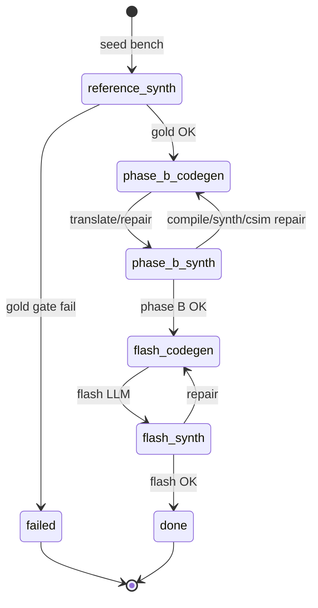

# Tier A Flash via batch_parallel — Design Spec

**Status:** Draft for review  
**Date:** 2026-07-01  
**Authors:** C2HLS / PC2 campaign harness  
**Replaces (for tier_A runs):** serialized `run_tier_a_flash_smoke.sh` + `run_benchmark_multistep` on a single compute node

---

## 1. Problem

Tier A flash smoke (`run_tier_a_flash_smoke_batch.py`) runs **one benchmark at a time** on **one compute node**. Each bench spends most of its wall time in Vitis (gold reference gate, Phase B csynth/csim, flash csynth/csim). The GPU runs LLM codegen only intermittently and sits idle during long gold synth timeouts (e.g. `forgebench_mlp` at 1200s).

Observed on `20260701_tier_a_flash_25_r2`: 7/25 benches in ~45 minutes, all failing at the gold gate; compute saturated while GPU `ready`.

## 2. Goal

Run tier_A_ready flash campaigns with:

| Resource | Count | Role |
|----------|-------|------|
| GPU (H100) | **1** | LLM `codegen` only — translate, repair, flash prompt |
| Compute nodes | **~4** | Vitis workers |
| Workers per node | **3** | Parallel csynth/csim slots |
| **Total Vitis parallelism** | **~12** (target ~10) | Gold + Phase B + flash synth work |
| RTL cosim | **0** | Not pursued for tier_A complex benches |

**GPU policy:** `always_on` — no parking, no unpark latency between codegen jobs.

**Skills / env:** Same as current tier_A smoke — 90 packaged skills, `all_skills_avoids_global`, `C2HLS_RUN_COSIM=0`, U280 @ 3.33ns, repair turns = 4.

## 3. Non-goals

- RTL cosim nodes or cosim repair loops for tier_A.
- Changing the Rodinia `aav_n` batch_parallel campaign behavior.
- Replacing `run_benchmark_multistep` for local/dev single-bench debugging (keep smoke script).
- Multivariant sweeps (single variant `tier_a_90` per campaign).

## 4. Architecture overview

Reuse the existing **batch_parallel** harness:

```
┌─────────────────────────────────────────────────────────────────┐
│  Login node: coordinator + watch + gpu_drain                     │
│  SQLite queue (batch_parallel_queue.py)                          │
└─────────────────────────────────────────────────────────────────┘
         │                              │
         ▼                              ▼
┌─────────────────┐          ┌──────────────────────────────────┐
│ 1× GPU          │          │ 4× compute (bp-synth only)        │
│ codegen drain   │          │ 3 workers/node → 12 synth slots   │
│ always_on       │          │ csynth + csim per job             │
└─────────────────┘          └──────────────────────────────────┘
```

### Job kinds (tier_A profile)

| Kind | Executor | Vitis work |
|------|----------|------------|
| `codegen` | GPU | None (LLM only) |
| `synth` | Compute | csynth + **csim** (no RTL cosim) |
| ~~`cosim`~~ | — | **Disabled** (`cosim_nodes_per_variant: 0`) |

### Per-bench state machine



**Key change vs Rodinia batch_parallel:** initial job is `synth / reference`, not `codegen / phase_b`. Gold gates for up to `max_inflight_benches` benches run **in parallel** on synth workers.

**Key change vs Rodinia synth path:** synth workers run **csim** inline (`run_csim_check=True`); they do **not** enqueue `cosim` followups.

## 5. Configuration

New campaign JSON: `scripts/pc2/batch_parallel_tier_a_flash.json`

```json
{
  "synth_nodes_per_variant": 4,
  "synth_workers_per_node": 3,
  "cosim_nodes_per_variant": 0,
  "cosim_workers_per_node": 0,
  "worker_cpus": 8,
  "worker_mem_gb": 32,
  "gpu_policy": "always_on",
  "max_inflight_benches": 10,
  "bench_order": "listed",
  "bench_seeding": "short_first_waves",
  "poll_sec": 2.0,
  "coordinator_poll_sec": 15.0,
  "pilot": {
    "variant": "tier_a_90",
    "workflow": "tier_a_flash",
    "corpus": "tier_A_ready",
    "benches": ["forgebench_attention_op_p1", "..."],
    "failure_policy": "ignore",
    "model": "mistralai/Devstral-2-123B-Instruct-2512",
    "turns": 4
  }
}
```

| Field | Value | Notes |
|-------|-------|-------|
| `synth_slots` | 4×3 = 12 | User asked ~10 parallel; 12 is acceptable headroom |
| `cosim_nodes_per_variant` | 0 | `start_batch_parallel_variant.sh` skips cosim loop |
| `gpu_policy` | `always_on` | Coordinator never parks GPU |
| `max_inflight_benches` | 10 | Caps concurrent benches in pipeline |
| `workflow` | `tier_a_flash` | Selects env, bench resolver, session class |

Environment applied on workers via `tier_a_flash_lib.configure_tier_a_flash_90skills_env()` (same as smoke).

## 6. Component design

### 6.1 `batch_parallel_tier_a_lib.py` (new)

Responsibilities:

- `TIER_A_VARIANT = "tier_a_90"`
- `resolve_tier_a_bench(name) -> Path` wrapping `tier_a_flash_lib.resolve_tier_a_benches`
- `configure_tier_a_campaign_env()` → calls `configure_tier_a_flash_90skills_env()`
- `cell_dir(campaign_root, bench, model_tag)` → `{variant}/{bench}/{model_tag}__flash__tier_a__90skills/`
- `workflow_from_campaign(campaign) -> str`

### 6.2 `TierABatchParallelBenchSession` (new, extends `BatchParallelBenchSession`)

File: `scripts/pc2/tier_a_batch_parallel_bench.py`

| Override | Behavior |
|----------|----------|
| `_synth_csim_only()` | `run_csim_check=True`, `run_cosim_check=False` |
| `_run_synth()` phase `reference` | Call `validate_gold_reference(inputs)`; write `reference_validation.json`; on pass enqueue `codegen phase_b translate`; on fail finalize |
| `_run_synth()` phase `phase_b` / `flash` | Use `_synth_csim_only`; on synth+csim success advance pipeline **without** `_cosim_followup`; on csim fail enqueue `codegen` repair (mirror cosim repair routing) |
| `_ensure_orchestrator()` | **Do not** call `validate_gold_reference` at init; load stored `reference_validation.json`; require `benchmark_ready` before Phase A |

Inherits codegen handling from `FlashPipelinedBenchSession` via `BatchParallelBenchSession` → `pipelined_phase_b_translate`, `pipelined_flash_codegen`, repair codegen paths unchanged.

### 6.3 Queue seeding (`batch_parallel_queue.py`)

Add workflow-aware seeding:

```python
def seed_bench(self, variant: str, bench: str, *, initial_kind: str = "codegen", initial_phase: str = "phase_b") -> None:
    ...
```

For `tier_a_flash`, campaign init passes `initial_kind="synth", initial_phase="reference"`.

`seed_initial_wave` unchanged — still respects `max_inflight_benches`.

### 6.4 Campaign drivers (modify existing)

| File | Change |
|------|--------|
| `batch_parallel_gpu_drain.py` | Branch on `workflow`: tier_a uses `tier_a_batch_parallel_bench.execute_job` + tier_a bench resolver + env |
| `batch_parallel_worker.py` | Same branch for synth workers |
| `start_batch_parallel_campaign.sh` | Pass `initial_seed` from config workflow when calling `seed_initial_wave` helpers |
| `start_tier_a_batch_parallel.sh` (new) | Thin wrapper: `--config batch_parallel_tier_a_flash.json`, stamp, bench list env override |

`batch_parallel_coordinator.py`: no functional change for `always_on`; `vitis_pipeline_busy` already checks only pending `synth`+`cosim` — with cosim=0, synth-only.

`start_batch_parallel_variant.sh`: already skips cosim when `COSIM_NODES=0`.

### 6.5 Artifacts layout

```
artifacts/pc2/batch_parallel_{stamp}/
  campaign.json
  queue.db
  flow/events.jsonl
  variants/tier_a_90/{bench}/devstral2__flash__tier_a__90skills/
    pipelined/orchestrator_state.json
    reference_validation.json          # new: gold gate result
    {bench}_multistep_results.json     # final summary (compat with smoke)
    {bench}_generated.cpp
    manifest row in matrix.json
```

Final results JSON should match smoke schema (`phase`, `success`, `steps`, `baseline_report`, `reference_validation`) for downstream analysis scripts.

### 6.6 Repair rounds (unchanged semantics)

| Stage | Max LLM repair turns | Trigger |
|-------|---------------------|---------|
| Phase A | 4 (`C2HLS_TURNS`) | plain.cpp compile fail (in `_ensure_orchestrator`) |
| Phase B | 4 | compile / synth / **csim** fail |
| Flash | 4 | compile / synth / **csim** fail |
| Regression guard | 2 outer | flash step metric regression (inherited from `run_optimization_step` logic in pipelined path if enabled) |

No quality-repair loop (same as multistep flash smoke).

## 7. Submission UX

```bash
# 10 forgebench pilot
export C2HLS_TIER_A_FLASH_BENCHES="forgebench_attention_op_p1,..."
./scripts/pc2/start_tier_a_batch_parallel.sh \
  --config scripts/pc2/batch_parallel_tier_a_flash.json \
  --stamp 20260701_tier_a_bp_forgebench10

# Full 25-bench list
./scripts/pc2/start_tier_a_batch_parallel.sh --stamp 20260701_tier_a_bp_25
```

Monitor:

```bash
tail -f artifacts/pc2/batch_parallel_${STAMP}/flow/events.jsonl
```

Stop:

```bash
BATCH_PARALLEL_CAMPAIGN_ROOT=... ./scripts/pc2/stop_batch_parallel_campaign.sh
```

## 8. Testing strategy

| Level | What |
|-------|------|
| Unit | `TierABatchParallelBenchSession._run_synth` reference / phase_b / flash followups; no cosim enqueue; csim fail → codegen repair |
| Unit | `seed_bench` with `reference` phase creates correct queue row |
| Unit | `batch_parallel_gpu_drain` resolves tier_A bench paths |
| Integration (dry-run) | `start_tier_a_batch_parallel.sh --dry-run` → 4 synth nodes, 0 cosim, 10 seeded reference jobs |
| Pilot | 2-bench smoke (`spector_hls_dct`, `forgebench_attention_op_p1`) on PC2 |

## 9. Risks and mitigations

| Risk | Mitigation |
|------|------------|
| Vitis license / `/tmp` contention at 12 parallel | Start with `max_inflight_benches=10`; tune `synth_nodes` if OOM |
| Reference validation duplicated logic | Call existing `validate_gold_reference()` on worker — no fork |
| Session init assumes sync gold gate | Explicit `reference_validation.json` + lazy orchestrator init |
| GPU drain hardcoded to `flash_fixed_cosim_lib` | Workflow branch in drain + worker |
| Long gold synth blocks a slot | Acceptable — 12 slots >> 1; failed gold frees slot quickly |

## 10. Success criteria

1. **Throughput:** 10 reference gates can run concurrently; wall time for 10-bench forgebench set dominated by slowest bench, not sum of serial gold times.
2. **Correctness:** Pass/fail outcomes match serialized smoke for `spector_hls_dct` (known pass) and a forgebench with fixed testbench (gold csim pass).
3. **GPU:** `gpu_mode=up` for entire campaign; no park events in `flow/events.jsonl`.
4. **Artifacts:** Compatible `*_multistep_results.json` under tier_A cell layout.

## 11. Rollout

1. Implement + unit tests (no Slurm).
2. Dry-run campaign init on login node.
3. **First production run:** deferred forgebench-10 (replace serialized `deferred_tier_a_forgebench_10_submit.sh` target).
4. **Second run:** full 25-bench tier_A list after forgebench-10 validates.

---

## Appendix A — Mapping from serialized smoke

| Serialized (`run_tier_a_flash_smoke`) | batch_parallel tier_a |
|---------------------------------------|------------------------|
| `run_benchmark_multistep` | Pipelined jobs via queue |
| Gold gate in `_run_benchmark_multistep_body` | `synth / reference` job |
| Phase A/B/flash in orchestrator | `codegen` + `synth` alternation |
| Single compute Slurm job | 4× `bp-synth` nodes |
| `start_session.sh` GPU+compute | GPU drain + watch submits synth nodes |
| `flash_tier_a_smoke_{stamp}/` | `batch_parallel_{stamp}/variants/tier_a_90/` |

## Appendix B — Related files (existing)

- `scripts/pc2/batch_parallel_queue.py` — job queue, seeding, slot claiming
- `scripts/pc2/batch_parallel_bench.py` — Rodinia flash pipelined + cosim split
- `scripts/pc2/flash_pipelined_bench.py` — pipelined orchestrator lifecycle
- `scripts/pc2/tier_a_flash_lib.py` — tier_A env + bench list
- `scripts/pc2/batch_parallel_full_aav_n_always_on.json` — reference for `always_on` policy
